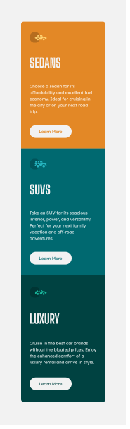
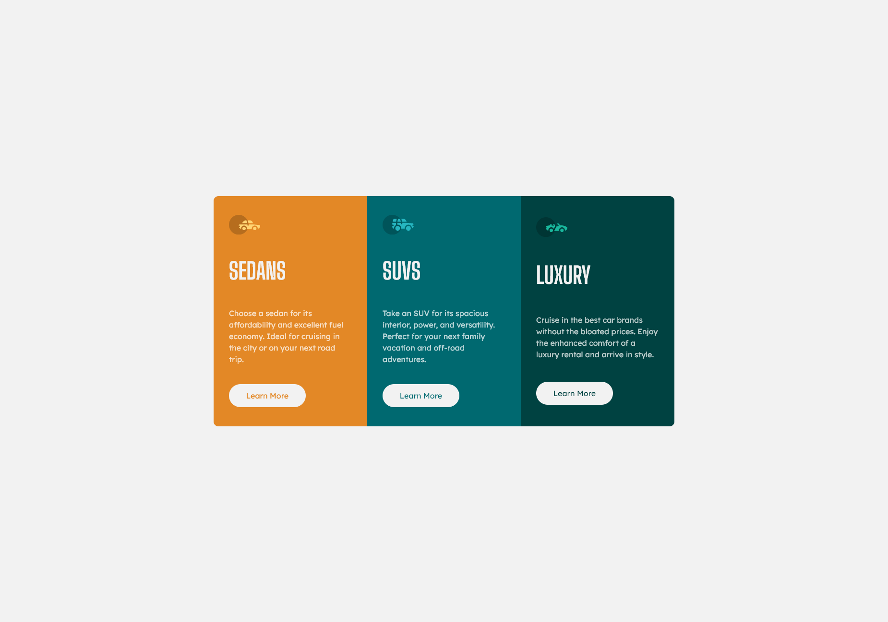

# Frontend Mentor - 3-column preview card component solution

This is a solution to the [3-column preview card component challenge on Frontend Mentor](https://www.frontendmentor.io/challenges/3column-preview-card-component-pH92eAR2-). Frontend Mentor challenges help you improve your coding skills by building realistic projects.

## Overview

### The challenge

Users should be able to:

- View the optimal layout depending on their device's screen size
- See hover states for interactive elements

### Screenshot

### Links

- Solution URL: [github](https://github.com/Passenger89/3-column-preview-card-component)
- Live Site URL: [netlify](https://3-column-preview-card.netlify.app/)

## My process

### Built with

- Semantic HTML5 markup
- CSS custom properties
- SASS
- Flexbox
- CSS Grid
- Mobile-first workflow

### What I learned

This project reinforced my knowledge of positioning using grid and flexbox. In addition, I learned the basics of sass architecture and the use of the @use and @forward rules.

### Useful resources

- [Kevin Powell](https://www.youtube.com/watch?v=CR-a8upNjJ0) - This video from Kevin helped me with partials and with moving from using the deprecated @import to using @use and @forward. furthermore, I learned more about the sass architecture and using @forward to grab variables and spit them out from a single index.scss file. I really liked this pattern and will use it going forward.

- [Kevin Powell](https://www.youtube.com/watch?v=wYWf2m_yzBQ&t=0s) - This is another video from Kevin that helped with the setting up and installation of Sass along with Parcel bundler which requires zero configuration.

## Author

- Frontend Mentor - [@Passenger89](https://www.frontendmentor.io/profile/Passenger89)